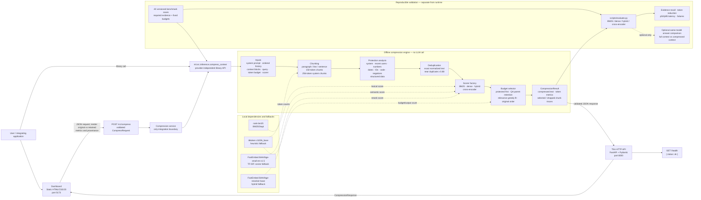

# ContextCore architecture

ContextCore is an offline-first, model-agnostic context-selection layer. It
reduces the evidence sent to a chat model without using a generative model in
the compression path. The optional evaluation adapter is the only component
permitted to call a real chat model.

## Integration contract

| Boundary | Direction | Specification |
|---|---|---|
| Dashboard to API | HTTP/JSON | `POST /v1/compress`; dashboard does not import engine code. `GET /health` returns `{"status":"ok"}`. |
| API to engine | Python | The backend calls only `ml.src.inference.compress_context(...)`. The public parameters are `system_prompt`, `history`, `context_blocks`, `query`, `token_budget`, and `scorer`. |
| Engine result to API/UI | Python model / JSON | `compressed_text`, `input_tokens`, `output_tokens`, `saved_tokens`, `compression_ms`, `selected_chunks`, and `dropped_chunks`. |
| Evaluation to engine | Python | Each fixture supplies the same inputs plus `required_evidence`; every scorer is measured at the identical case budget. |
| Optional evaluator to chat model | Provider adapter | This path is evaluation-only. It sends identical query/model configuration with full and compressed context; it is not part of `/v1/compress`. |

## Compression-path specifications

| Component | Current specification | Explainability / safety guarantee |
|---|---|---|
| Input model | Ordered messages use roles `system`, `user`, or `assistant`; context blocks have `id`, `content`, and optional `source`. | Original indices and source identifiers carry into every chunk trace. |
| Tokenization | `tiktoken` `cl100k_base`; a conservative local fallback is available if the tokenizer cannot load. | Input/output counts and every chunk's token count are reported. |
| Chunker | Splits by paragraphs, then lines/sentences when needed. General chunks are 150 tokens maximum; system-prompt chunks are 256 tokens maximum. | Each fragment receives a stable ID, source type, source, original index, and text. |
| Protection | Retains system instructions and recent user turns by default; regex checks protect code, numeric values, dates, identifiers, negations, and structured table/JSON/YAML-like data. | Protected content is never silently dropped; if it drives a budget overrun, its trace explains why. |
| Deduplication | Exact matches use normalized text. Near duplicates use RapidFuzz when installed, otherwise Jaccard similarity; threshold is `0.88`. | Duplicate traces name the retained chunk and the similarity where applicable. |
| Retrieval | `bm25`, `dense`, `hybrid`, and `cross_encoder` are accepted scorer values. BM25 is lexical; dense uses `BAAI/bge-small-en-v1.5` when locally available; cross-encoder uses `BAAI/bge-reranker-base` when locally available. | Dense falls back to local TF-IDF cosine; cross-encoder falls back to hybrid. Scores are relative ranks, not probabilities. |
| Selection | Keeps non-duplicate protected chunks first, then greedily admits highest-scoring chunks that fit the budget. An assistant answer retains its directly preceding user question when necessary. | Selected output is re-sorted to original input order; every nonselected item has a drop rationale. |
| Provenance | A `ChunkTrace` contains `id`, `source_type`, `source`, `original_index`, `text`, `token_count`, `selected`, `protected`, `score`, and `reason`. | The UI can show kept, protected, and dropped evidence with the exact decision reason. |

## Runtime deployment

`docker compose up --build` creates two services: the FastAPI backend on
`8000` and an Nginx-served static dashboard on `5173`. The backend mounts
`./ml/models` and `./data`; model weights and raw datasets remain outside Git.
The compression request needs no provider key. CORS origins are configured in
the backend, so a deployed dashboard can use the HTTP boundary rather than a
direct Python import.

## Design constraints

- No generative LLM, hosted API, or provider credential may be introduced on the compression path.
- Dependencies must be locally usable and documented in `docs/ACKNOWLEDGEMENTS.md`.
- Benchmark reports state the tokenizer and record evidence recall, token reduction, p50/p95 compression latency, and failures.
- `docs/contract.md` remains the source of truth for shared HTTP and engine schemas; update it before any contract change.
